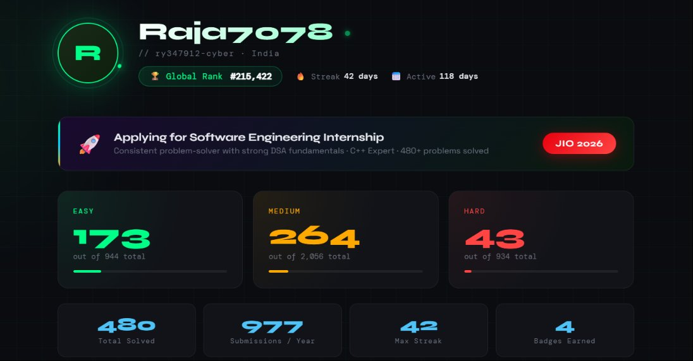
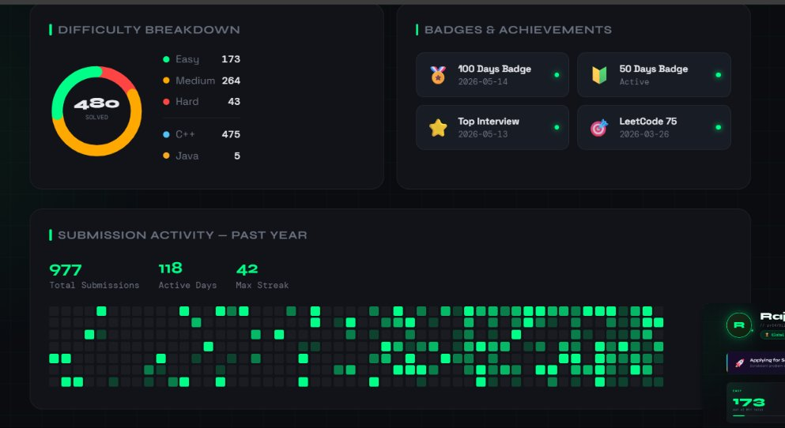
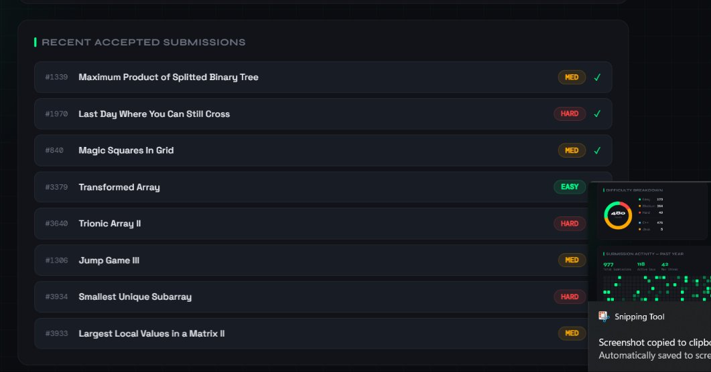
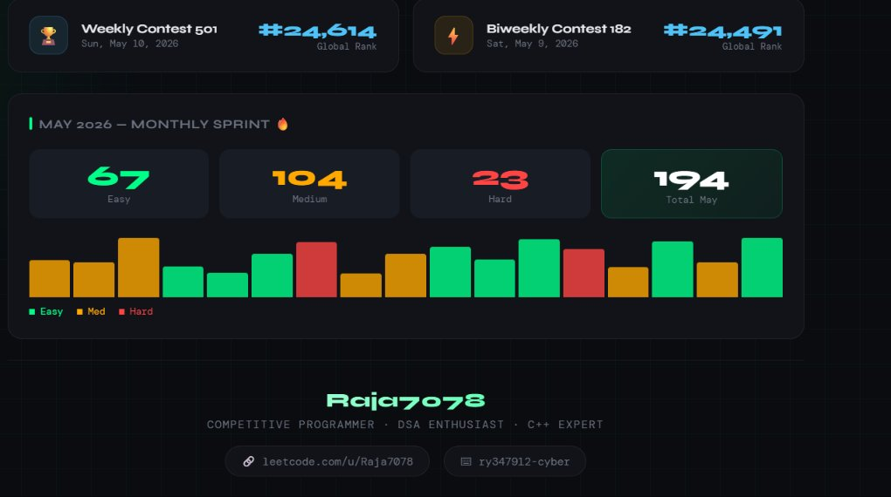

<div align="center">

```
██████╗  █████╗      ██╗ █████╗ ███████╗ ██████╗ ███████╗
██╔══██╗██╔══██╗     ██║██╔══██╗╚════██║██╔═████╗╚════██║
██████╔╝███████║     ██║███████║    ██╔╝██║██╔██║    ██╔╝
██╔══██╗██╔══██║██   ██║██╔══██║   ██╔╝ ████╔╝██║   ██╔╝
██║  ██║██║  ██║╚█████╔╝██║  ██║   ██║  ╚██████╔╝   ██║
╚═╝  ╚═╝╚═╝  ╚═╝ ╚════╝ ╚═╝  ╚═╝   ╚═╝   ╚═════╝    ╚═╝
```

# Hey, I'm Raja7078 👋
### Competitive Programmer · DSA Enthusiast · C++ Developer

[](https://leetcode.com/u/Raja7078/)
[](https://github.com/ry347912-cyber)
[](https://en.wikipedia.org/wiki/India)
[](https://leetcode.com/u/Raja7078/)

</div>

---

## 🖥️ LeetCode Profile Dashboard

<div align="center">









</div>

---

## 🏆 LeetCode Stats — May 2026

<div align="center">

| 🟢 Easy | 🟡 Medium | 🔴 Hard | 📊 Total |
|:---:|:---:|:---:|:---:|
| **173** | **264** | **43** | **480** |
| /944 | /2056 | /934 | problems |

</div>

```
Progress ████████████████████░░░░░░░░░░░░░░░░░░░░  480 / 3934 Solved
Easy     ████████░░░░░░░░░░░░░░░░░░░░░░░░░░░░░░░░  173 / 944  (18.3%)
Medium   █████░░░░░░░░░░░░░░░░░░░░░░░░░░░░░░░░░░░  264 / 2056 (12.8%)
Hard     ██░░░░░░░░░░░░░░░░░░░░░░░░░░░░░░░░░░░░░░   43 / 934  ( 4.6%)
```

---

## 🔥 Activity Highlights

<div align="center">

| Metric | Value |
|--------|-------|
| 🌍 Global Rank | **#215,422** |
| 📅 Total Active Days | **118 days** |
| ⚡ Max Streak | **42 days** |
| 📬 Submissions (1 year) | **977** |
| 🏅 Badges Earned | **4** |

</div>

---

## 🚀 May 2026 Sprint — THIS MONTH

> **194 problems solved in a single month!** 🔥

<div align="center">

| 🟢 Easy | 🟡 Medium | 🔴 Hard | Total |
|:---:|:---:|:---:|:---:|
| 67 | 104 | 23 | **194** |

</div>

---

## 🏅 Badges & Certifications

<div align="center">

| Badge | Status | Date |
|-------|--------|------|
| 🏅 **100 Days Badge 2026** | ✅ Earned | 2026-05-14 |
| 🔰 **50 Days Badge** | ✅ Active | Active |
| ⭐ **Top Interview 150** | ✅ Earned | 2026-05-13 |
| 🎯 **LeetCode 75** | ✅ Earned | 2026-03-26 |

</div>

---

## ⚔️ Contest Performance

<div align="center">

| Contest | Date | Rank |
|---------|------|------|
| 🏆 Weekly Contest 501 | Sun, May 10, 2026 | **#24,614** |
| ⚡ Biweekly Contest 182 | Sat, May 9, 2026 | **#24,491** |

</div>

---

## 💻 Languages & Tools

<div align="center">


</div>

```
C++  ████████████████████████████████████████████████████  475 problems (99%)
Java █                                                         5 problems  (1%)
```

---

## 📈 Recent Accepted Submissions

```
✅ #1339  Maximum Product of Splitted Binary Tree    [Medium]
✅ #1970  Last Day Where You Can Still Cross          [Hard]
✅ #840   Magic Squares In Grid                       [Medium]
✅ #3379  Transformed Array                           [Easy]
✅ #3640  Trionic Array II                            [Hard]
✅ #1306  Jump Game III                               [Medium]
✅ #3934  Smallest Unique Subarray                    [Hard]
✅ #3933  Largest Local Values in a Matrix II         [Medium]
✅ #3932  Count K-th Roots in a Range                 [Medium]
```

---

## 📊 Submission Heatmap (Past Year)

```
May Jun Jul Aug Sep Oct Nov Dec Jan Feb Mar Apr May
░░  ░░  ▒▒  ▒▒  ▒▒  ▓▓  ▓▓  ▓▓  ██  ██  ██  ██  ██  ← Increasing activity!
```
> 977 submissions · 118 active days · 42-day max streak

---

## 🎯 Approach to Problem Solving

```
1. Read & understand constraints
2. Think brute force → optimize
3. Implement in C++ (fast & efficient)
4. Test edge cases
5. Submit & learn from mistakes
```

---

## 📬 Connect With Me

<div align="center">

[](https://leetcode.com/u/Raja7078/)
[](https://github.com/ry347912-cyber)

---

*"Consistency beats talent when talent doesn't work consistently."*


</div>

---

<div align="center">
<sub>📍 India &nbsp;|&nbsp; 💼 Open to Internships &nbsp;|&nbsp; 🔥 Solving DSA daily</sub>
</div>
